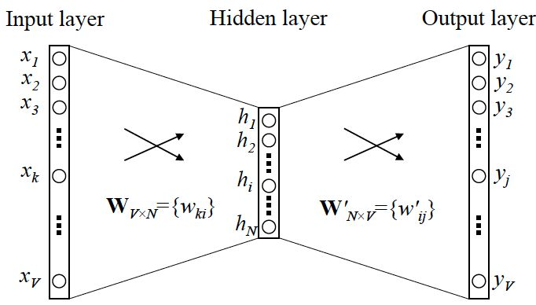
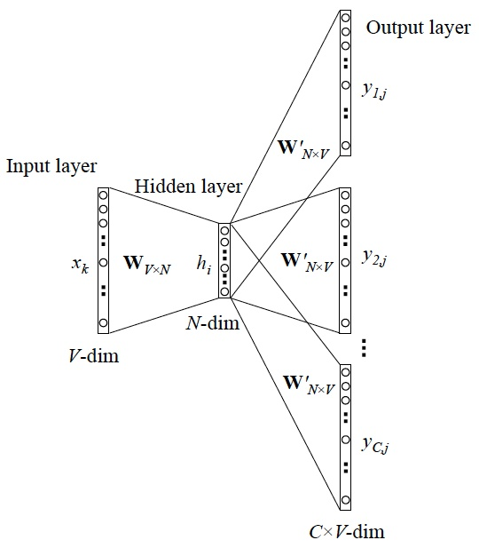

<!-- TOC -->

- [.1. 介绍](#1-%e4%bb%8b%e7%bb%8d)
- [.2. 背景知识](#2-%e8%83%8c%e6%99%af%e7%9f%a5%e8%af%86)
  - [.2.1. 哈夫曼树与哈夫曼编码](#21-%e5%93%88%e5%a4%ab%e6%9b%bc%e6%a0%91%e4%b8%8e%e5%93%88%e5%a4%ab%e6%9b%bc%e7%bc%96%e7%a0%81)
- [.2. 使用模型(Skip-gram和CBOW)](#2-%e4%bd%bf%e7%94%a8%e6%a8%a1%e5%9e%8bskip-gram%e5%92%8ccbow)
  - [.2.1. Skip-gram](#21-skip-gram)
    - [简单情形](#%e7%ae%80%e5%8d%95%e6%83%85%e5%bd%a2)
    - [.2.1.1. 更一般的情形](#211-%e6%9b%b4%e4%b8%80%e8%88%ac%e7%9a%84%e6%83%85%e5%bd%a2)
  - [.2.2. CBOW](#22-cbow)
    - [一般情形](#%e4%b8%80%e8%88%ac%e6%83%85%e5%bd%a2)

<!-- /TOC -->

## .1. 介绍
> word2vec是Google于2013年推出的开源的获取词向量word2vec的工具包。它包括了一组用于word embedding的模型，这些模型通常都是用浅层（两层）神经网络训练词向量。  
> Word2vec的模型以大规模语料库作为输入，然后生成一个向量空间（通常为几百维）。词典中的每个词都对应了向量空间中的一个独一的向量，而且语料库中拥有共同上下文的词映射到向量空间中的距离会更近。

> 在NLP里面，最细粒度的是**词语**，所以先拿词语开刀。  
> 举例：判断一个词的词性，是动词还是名词。用机器学习的思路，我们有一系列样本(x,y)，这里 x 是词语，y 是它们的词性，我们要构建 f(x)->y 的映射，但这里的数学模型 f（比如神经网络、SVM）只接受数值型输入，而 NLP 里的词语，是人类的抽象总结，是符号形式的（比如中文、英文、拉丁文等等），所以需要把他们转换成数值形式，或者说——嵌入到一个数学空间里，这种嵌入方式，就叫词嵌入（word embedding)，而 Word2vec，就是词嵌入（ word embedding) 的一种。  
> 在 NLP 中，把 x 看做一个句子里的一个词语，y 是这个词语的上下文词语，那么这里的 f，便是 NLP 中经常出现的『语言模型』（language model），这个模型的目的，就是判断 (x,y) 这个样本，是否符合自然语言的法则，更通俗点说就是：词语x和词语y放在一起，是不是人话。  
> Word2vec 正是来源于这个思想，但它的最终目的，不是要把 f 训练得多么完美，而是只关心模型训练完后的副产物——模型参数（这里特指神经网络的权重），并将这些参数，作为输入 x 的某种向量化的表示，这个向量便叫做——词向量。  
> 举例：  
> * 对于一句话：『她们 夸 吴彦祖 帅 到 没朋友』，如果输入 x 是『吴彦祖』，那么 y 可以是『她们』、『夸』、『帅』、『没朋友』这些词  
> * 现有另一句话：『她们 夸 我 帅 到 没朋友』，如果输入 x 是『我』，那么不难发现，这里的上下文 y 跟上面一句话一样
> * 从而 f(吴彦祖) = f(我) = y，所以大数据告诉我们：我 = 吴彦祖（完美的结论）  

## .2. 背景知识

### .2.1. 哈夫曼树与哈夫曼编码
**暂略，可见数据结构**

## .2. 使用模型(Skip-gram和CBOW)
输入形式： **one-hot encoder**

### .2.1. Skip-gram
#### 简单情形
接下来就可以看看 Skip-gram 的网络结构了，x 就是上面提到的 one-hot encoder 形式的输入，y 是在这 V 个词上输出的概率，我们希望跟真实的 y 的 one-hot encoder 一样。

**(!!!)**

#### .2.1.1. 更一般的情形

### .2.2. CBOW
#### 一般情形
！[cbow](cbow.jpg)